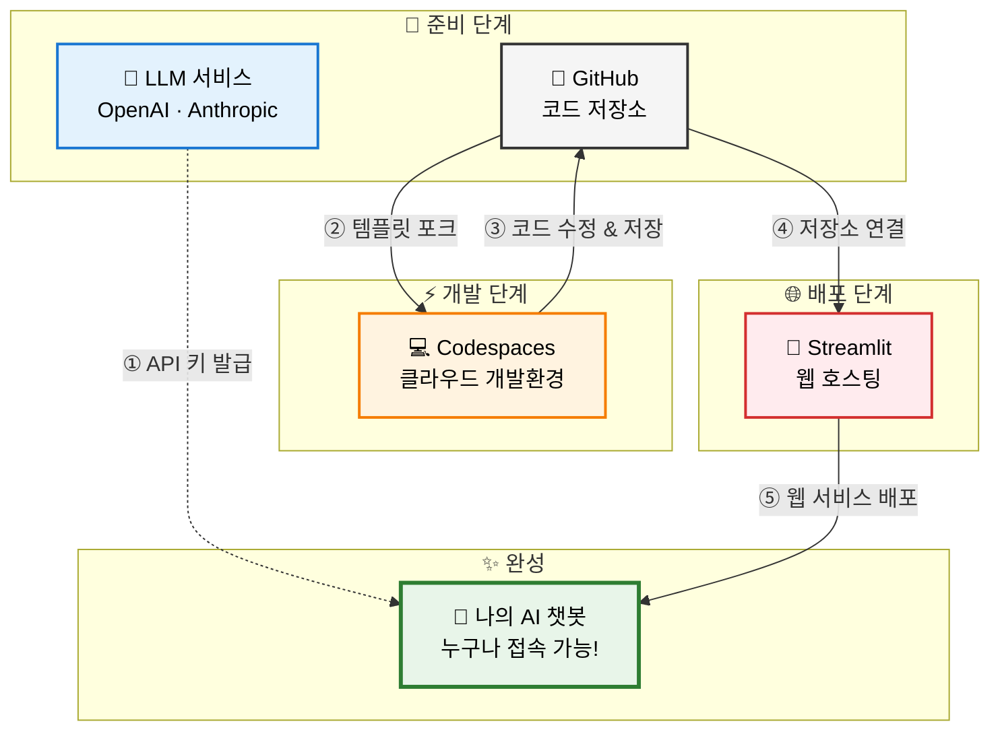

# 나만의 AI 챗봇 서비스 제작 가이드

본 과제는 나만의 AI 챗봇 서비스 제작 방법을 설명한다.
아래 제작 과정을 따라하면, 나만의 AI 챗봇을 만들 수 있다.

## 설치

```bash
pip install -r requirements.txt
```

## 실행

```bash
export CEREBRAS_API_KEY="your-api-key"
python main.py
```

## 제작 과정 요약



| 순서 | 관계 | 설명 |
|:---:|:---|:---|
| ① | LLM → 챗봇 | API 키를 발급받아 챗봇이 AI 기능을 사용할 수 있게 연결 |
| ② | GitHub → Codespaces | 템플릿 저장소를 포크하면 Codespaces에서 개발 시작 |
| ③ | Codespaces → GitHub | 수정한 코드가 자동으로 GitHub에 저장 |
| ④ | GitHub → Streamlit | Streamlit이 GitHub 저장소의 코드를 가져옴 |
| ⑤ | Streamlit → 챗봇 | 코드를 웹 서비스로 배포하여 챗봇 완성 |


| 주체 | 설명 |
|:---:|:---|
| 🤖 **LLM 서비스** | 챗봇의 두뇌 역할. OpenAI, Anthropic 등에서 API 키를 발급받아 AI 기능 사용 |
| 🐙 **GitHub** | 코드를 저장하고 관리하는 공간. 템플릿을 포크하여 내 프로젝트로 복사 |
| 💻 **Codespaces** | 브라우저에서 바로 코딩할 수 있는 클라우드 개발환경 |
| 🚀 **Streamlit** | 코드를 실제 웹사이트로 배포해주는 호스팅 플랫폼 |
| 💬 **AI 챗봇** | 최종 완성된 서비스. 고유 URL로 누구나 접속 가능 |
